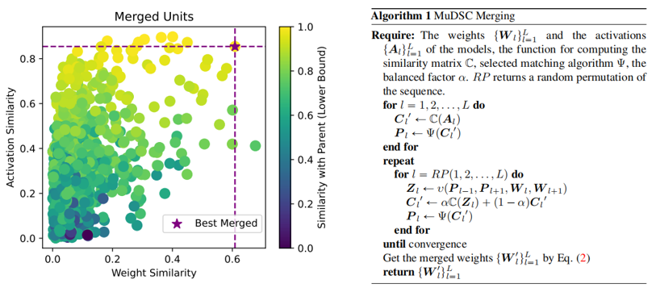
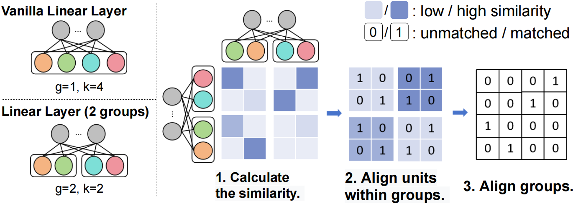
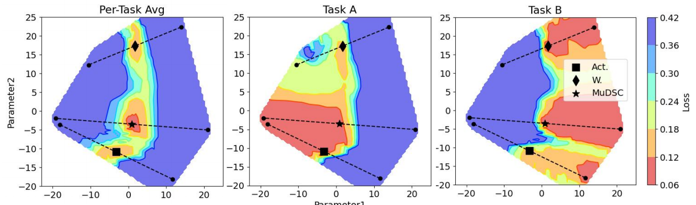

# Training Free Pretrained Model Merging

This repository is the implementation of the paper [Training Free Pretrained Model Merging]().

## Overview

1. We highlight the inconsistency of unit similarity in weight space and activation space. A novel model merging framework *MuDSC (Merging under Dual-Space Constraints)* is proposed that encourages both the activation spaces and weight spaces between two models be of high similarity.

   

2. The group matching is designed to make the matching algorithms applicable to models with group structure e.g. ViT and Group Normalization.

   

3. A vigorous experimental study was presented and show that MuDSC can significantly boost the merged performance in manifold multi-task scenarios for various architectures. Further loss landscape visualization verifies that our solution locates in the overlapping part with unified lower loss of each task.

   

## Dependencies

Our code is implemented and tested on PyTorch. Following packages are used:

~~~shell
tqdm
matplotlib
pandas
pyyaml
scikit-learn
fvcore
einops
easydict
networkx
scikit-image
opencv-python==4.6.0.66
timm==0.9.2
seaborn
# pygraphviz
clip @ git+https://github.com/openai/CLIP.git@d50d76daa670286dd6cacf3bcd80b5e4823fc8e1
~~~

You can install pytorch with following command:

~~~shell
pip install torch==1.12.1+cu116 torchvision==0.13.1+cu116 torchaudio==0.12.1 --extra-index-url https://download.pytorch.org/whl/cu116
~~~

Then, install the rest of dependencies:

```shell
pip install -r requirements.txt
```

## Experiment

- [Merging Models of Homogeneous Tasks](homogeneous_tasks/README.md)
- [Merging Models of Heterogeneous Tasks](heterogeneous_tasks/README.md)
- [Loss Landscape Visualization](loss_landscape/README.md)

## Citation

~~~
@inproceedings{
    xu2024trainingfree,
    title={Training-free Pretrained Model Merging},
    author={Xu, Zhengqi and Yuan, Ke and Wang, Huiqiong and Wang, Yong and Song, Mingli and Song, Jie},
    booktitle={Conference on Computer Vision and Pattern Recognition 2024},
    year={2024}
}
~~~

## Contact

If you have any question, please feel free to contact

Zhengqi Xu, [xuzhengqi@zju.edu.cn](mailto:chenyix@zju.edu.cn).
